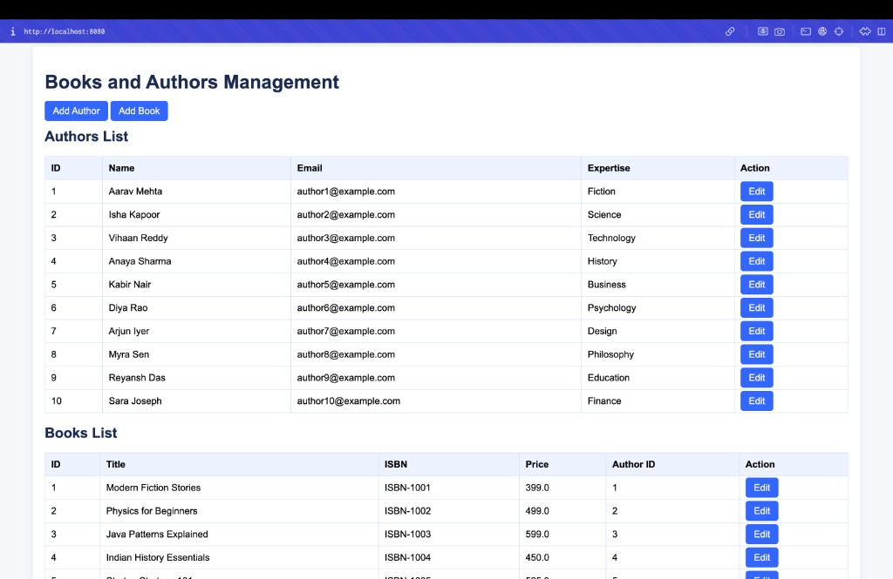
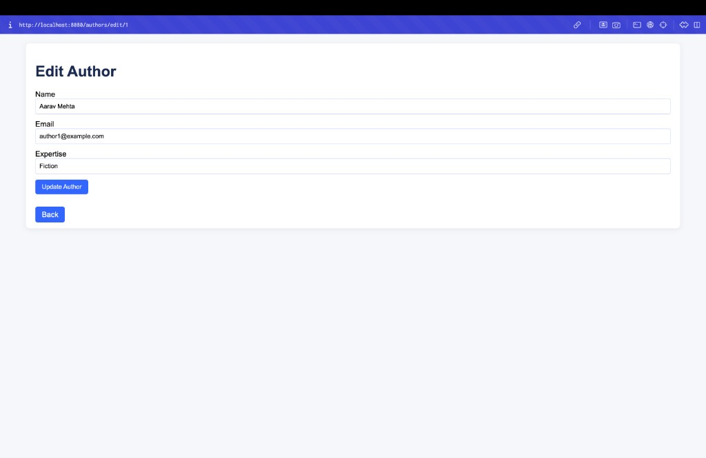
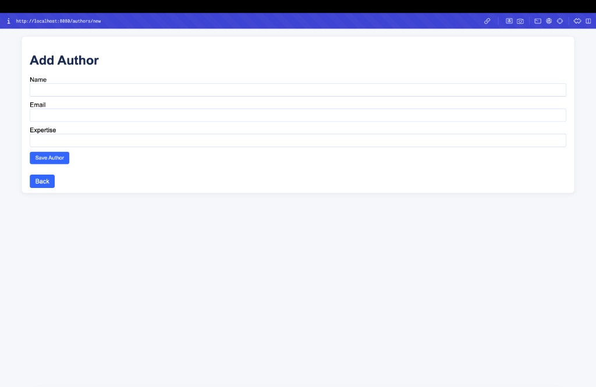
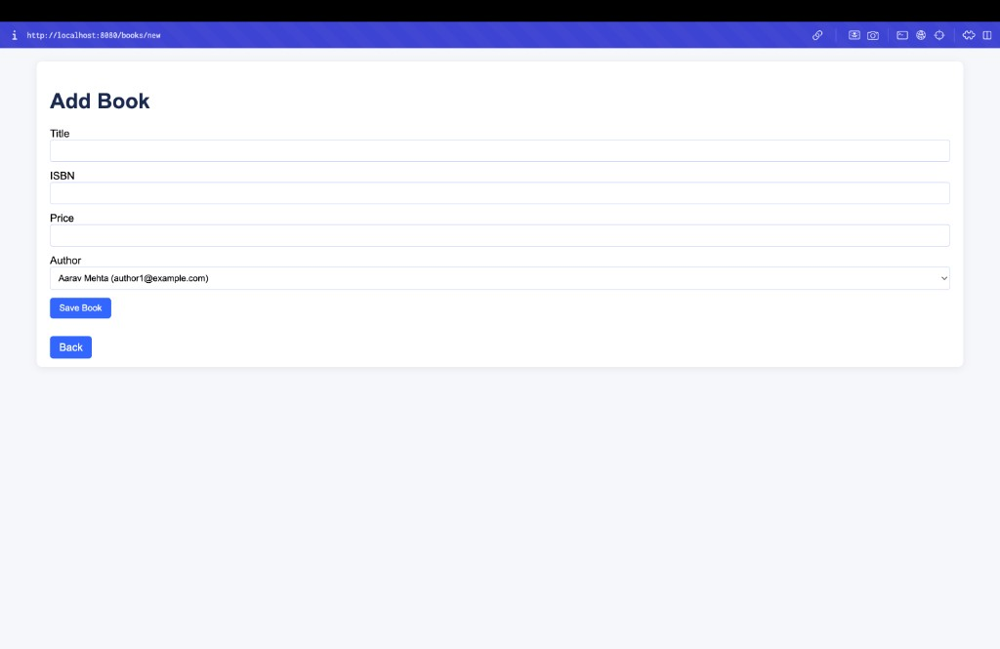
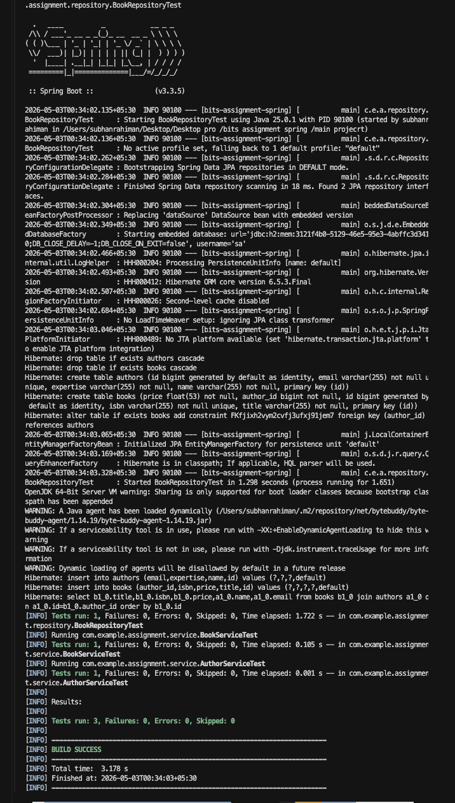

# BITS Spring Assignment

Spring Boot MVC application using JSP, JPA, and H2 for managing `Author` and `Book` entities with create, read, and update operations.

## Screenshots

Images live in `docs/screenshots/` and match the latest UI captures for this assignment.

### Dashboard (home)

Full dashboard at `http://localhost:8080/` showing authors, books, and the inner join table.



### Edit author

Edit form opened from **Edit** on an author row.



### Add author



### Add book



### Tests (`mvn test`)



## Run

```bash
mvn spring-boot:run
```

Open: `http://localhost:8080`

## Test

```bash
mvn test
```
